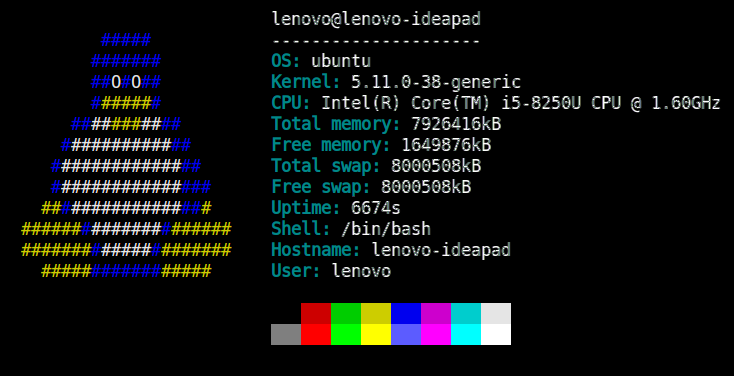

	
	<h1 align="center">lysfetch</h2>
	
A sysfetch-like program written in Lua

	
	
	
	   
	

A really simple program written in Lua similar to [neofetch](https://github.com/dylanaraps/neofetch)/[sysfetch](https://github.com/ecksemzee/sysfetch) that displays basic information.

## Usage
Use the `-h` or `--help` parameters to see the program usage

## Make
Use `make all` to see all the make targets.

### Installing
Run `make` or `make install` which will copy `lysfetch.lua` to `/usr/bin` as `lysfetch` and run `chmod +x` on it
