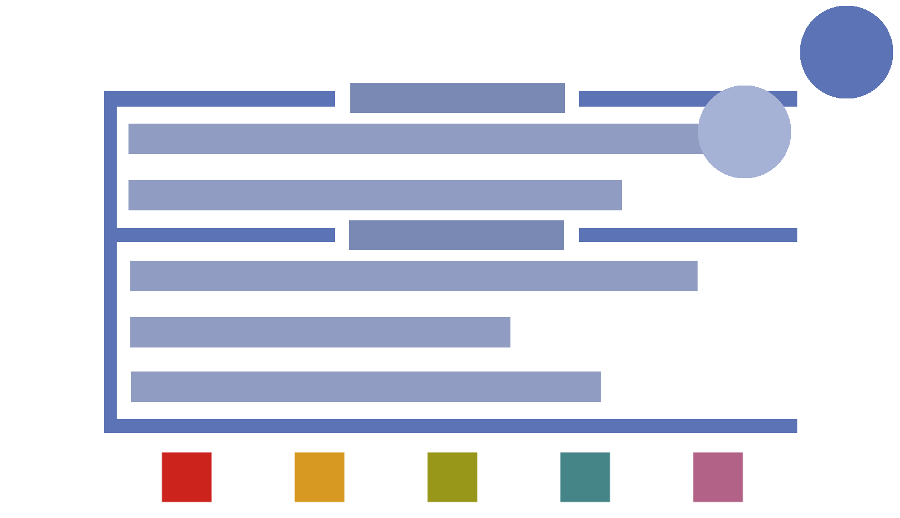

	
	<h1 align="center">lysfetch</h2>
	
A system information fetch program written in lua

	
	
	
	   
	

## Table of contents
* [Introduction](#introduction)
* [Usage](#usage)
* [Customization](#customization)
  * [Variables](#variables)
  * [String format variables](#string-format-variables)
    * [g_title_format](#g_title_format)
      * [Hardware](#hardware)
      * [Software](#software)
    * [g_label_format](#g_label_format)
    * [g_section_format](#g_section_format)
    * [g_color_format](#g_color_format)
      * [Normal foreground](#normal-foreground)
      * [Bright foreground](#bright-foreground)
      * [Normal background](#normal-background)
      * [Bright background](#bright-background)
      * [Attributes](#attributes)
* [Make](#make)

## Introduction

Lysfetch is a command line program written in Lua that displays basic system information.
It can be easily customized in the source code or using command line parameters.
More about configuring lysfetch in lysfetch.lua

## Usage
Use the `-h` or `--help` parameters to see the program usage

## Customization
To customize lysfetch, you can either modify the settings section in the source (lysfetch.lua), or
use command line parameters (use the `-h` or `--help` parameters for command line parameters help).

### Variables
Customizing is simply done by setting the values of a few variables. You can see them and their types
using the `-vv` or `--vars` parameters.

### String format variables
These variables are special, because they also have a format syntax; a constant name typed in between
`${` `}`. This syntax is used to specify where certain info/text will be, or what color will be used
from that point. All the format variables and the constants that can be used in them are below.
The `g_color_format` constants can be used in all of the format variables.

#### g_title_format
##### Hardware
- `info_device`     - the product name
- `info_cpu`        - the CPU
- `info_mem_used`   - amount of RAM used in kB/MB
- `info_mem_total`  - total amount of RAM in kB/MB
- `info_mem_free`   - amount of free RAM in kB/MB
- `info_swap_used`  - amount of swap used in kB/MB
- `info_Swap_total` - total amount of swap in kB/MB
- `info_swap_free`  - amount of free swap in kB/MB

##### Software
- `info_os`       - OS name
- `info_kernel`   - kernel version
- `info_term`     - terminal info
- `info_shell`    - shell
- `info_de`       - desktop environment
- `info_uptime`   - uptime (hours minutes seconds)
- `info_up_secs`  - uptime seconds
- `info_up_mins`  - uptime minutes
- `info_up_hours` - uptime hours
- `info_home`     - home directory
- `info_user`     - the users name
- `info_host`     - hostname
- `info_bios`     - bios version

#### g_label_format
- `label`        - the label
- `align_spaces` - an offset calculated to align the info part

#### g_section_format
- `section` - the section name

#### g_color_format
##### Normal foreground
- `fg_red`
- `fg_green`
- `fg_yellow`
- `fg_blue`
- `fg_magenta`
- `fg_cyan`
- `fg_white`

##### Bright foreground
- `fg_bred`
- `fg_bgreen`
- `fg_byellow`
- `fg_bblue`
- `fg_bmagenta`
- `fg_bcyan`
- `fg_bwhite`

##### Normal background
- `bg_red`
- `bg_green`
- `bg_yellow`
- `bg_blue`
- `bg_magenta`
- `bg_cyan`
- `bg_white`

##### Bright background
- `bg_bred`
- `bg_bgreen`
- `bg_byellow`
- `bg_bblue`
- `bg_bmagenta`
- `bg_bcyan`
- `bg_bwhite`

##### Attributes
- `attr_reset`   - reset to default colors and attributes
- `attr_bold`
- `attr_dim`
- `attr_italics`
- `attr_underl`  - foreground underlined
- `attr_blink`   - the foreground will blink synchronously
- `attr_reverse` - reversed background and foreground colors

## Make
Run `make all` to see all the make rules
